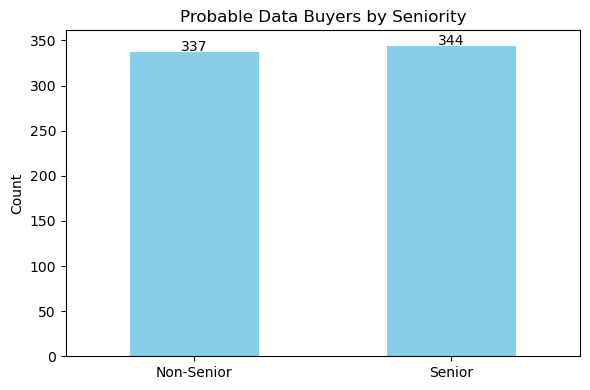
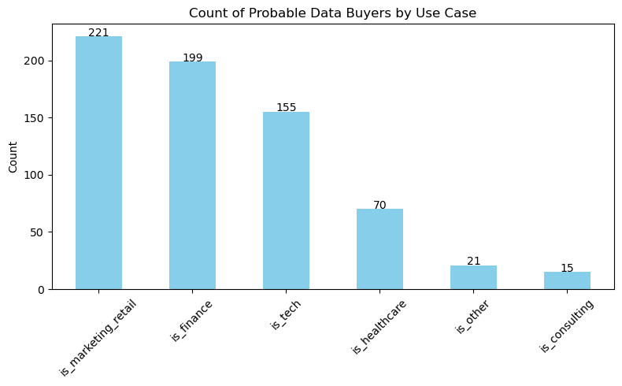
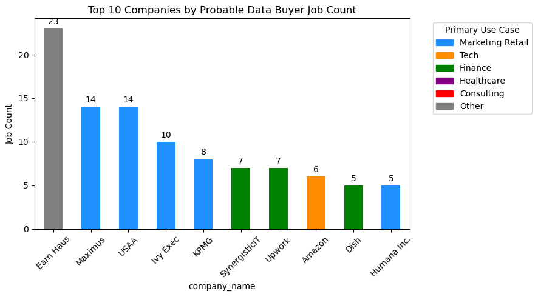
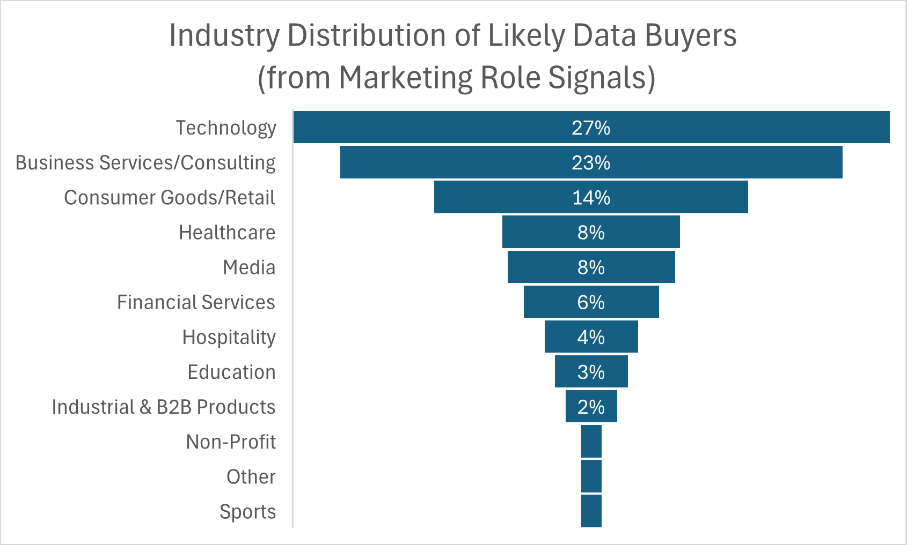
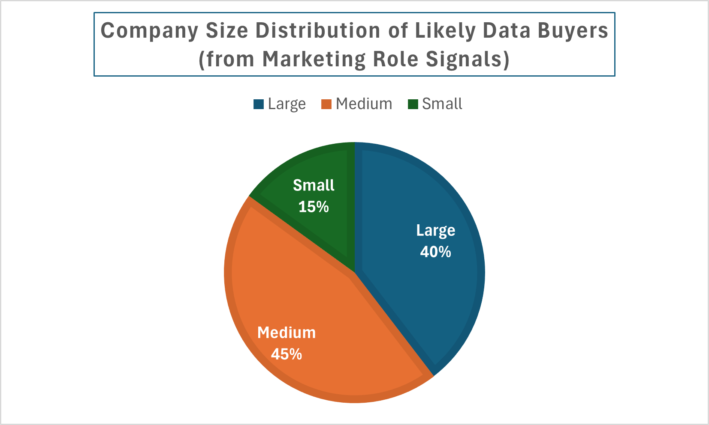
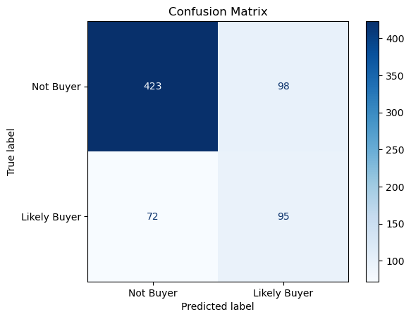
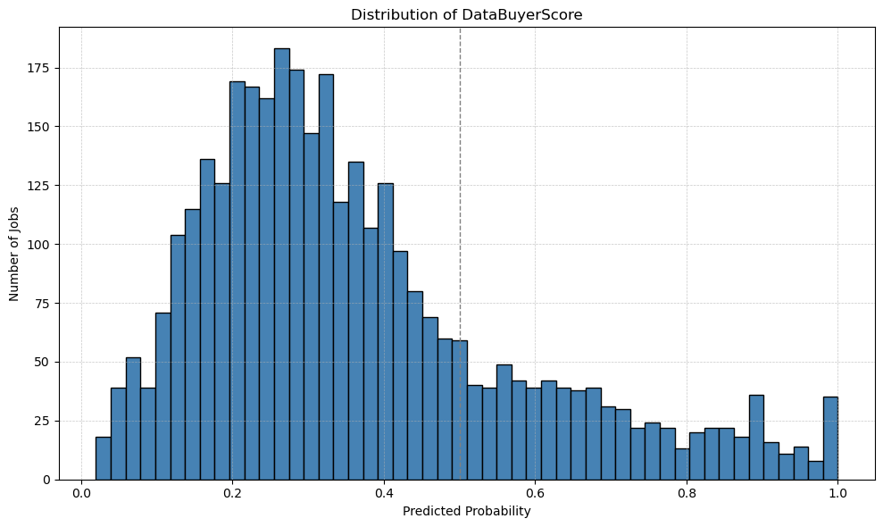
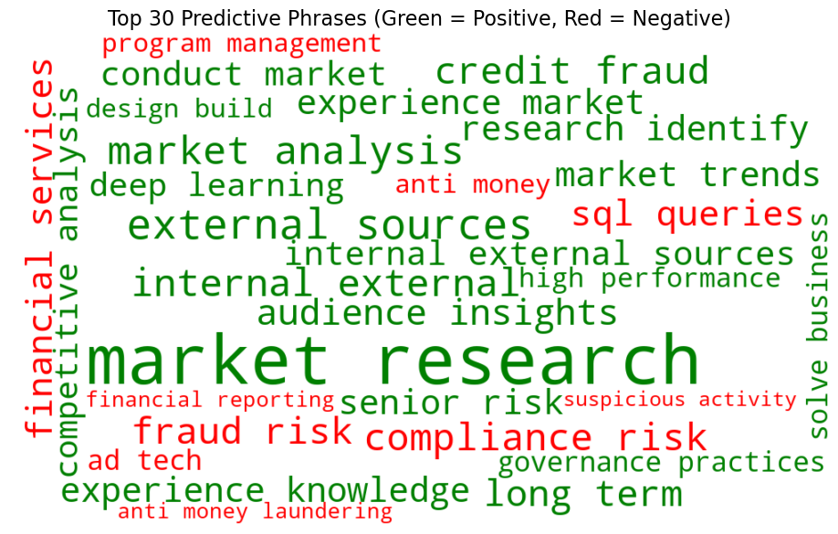
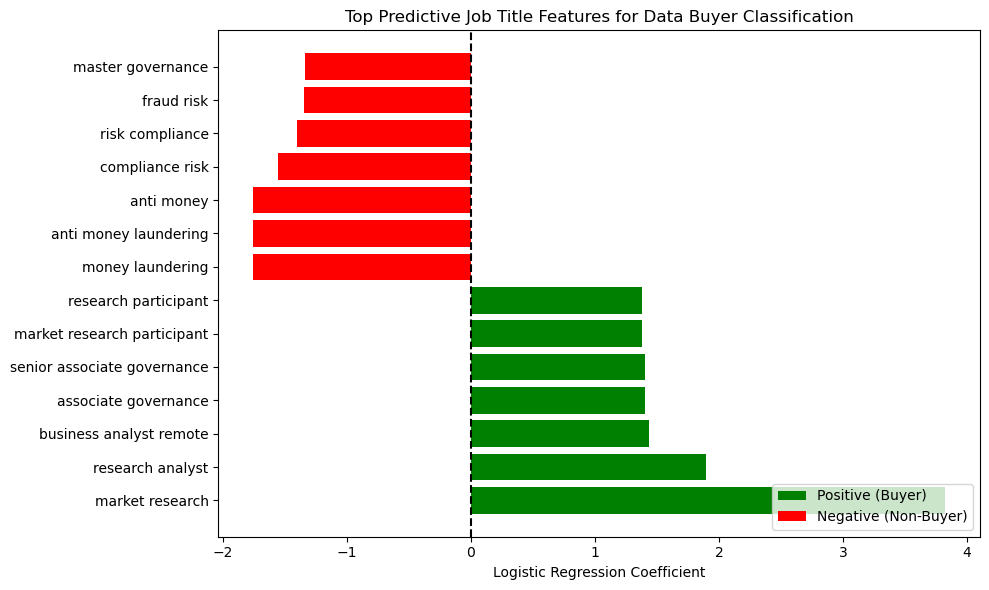

#  Identifying Data Buyers from Job Postings

This project aims to identify companies — particularly in the private sector — that are likely buyers of external data, based on patterns in their job postings. By analyzing thousands of roles across general, marketing, and finance domains, the project infers data-buying intent. 

I collected job postings from public APIs, applied structured cleaning, keyword analysis, and natural language processing, and built a logistic regression model to flag roles indicative of external data use. This includes not only roles with explicit terms like “data procurement” or “market intelligence,” but also more implicit signals found in titles, responsibilities, and industry-specific language.

The model outputs a binary flag indicating likely data buyer roles, a probability score (DataBuyerScore) representing model confidence, and key phrases to target when identifying data buyers. 

This framework supports a range of strategic use cases:

- Sales Enablement: Identify companies or teams with strong inferred demand for external datasets
- Partnership Targeting: Flag high-probability data buyers for outreach or collaboration
- Market Intelligence: Monitor emerging signals of data usage trends across industries and job functions

## Step 1: Data Scraping and JSON Conversion

Job postings were collected from Google Jobs using a standardized pipeline based on two modular Python scripts:

**`jobs_retrieval.py`**
- Queries Google Jobs via [SerpAPI](https://serpapi.com/) using predefined job titles.
- Supports pagination and rate-limiting safeguards.
- Saves results into `.json` files with search term and timestamp.

**`jobs_data_conversion.py`**
- Parses raw `.json` files and extracts structured fields:
  - `job_id`, `title`, `company_name`, `location`
  - `description`, `responsibilities` (from nested `job_highlights`)
- Adds metadata such as the originating search query.
- De-duplicates entries and saves clean `.csv` outputs.

###  Job Role Queries Used to Form Dataset
Job role queries can be customized for each new run. The SERP API has a maximum of 100 hits for each free account.

General roles
- `"data procurement"`
- `"data scientist"`
- `"data analyst"`
- `"data governance"`

Marketing roles
- `"digital marketing"`
- `"marketing analyst"`
- `"audience insights"`
- `"advertising analytics"`
- `"marketing data"`
- `"marketing insights"`
- `"marketing strategy"`

Finance roles
- `"fraud risk"`
- `"fraud analyst"`
- `"financial crime"`
- `"anti-money laundering"`
- `"transaction monitoring"`
- `"risk analytics"`
- `"compliance risk"`
- `"credit risk modeling"`
- `"credit risk"`
- `"market risk"`

##  Step 2: Keyword-Based Signal Detection

To identify roles that imply potential data buying behavior, I applied keyword filtering across multiple rounds of scraped job postings.

Each analysis round targeted a distinct subset of job types (general, marketing, finance) and used curated keyword lists to flag matches within job descriptions and responsibilities. The curated keyword list can be customized based on evolving use cases and market needs. 

###  How It Works

- **Regex-based keyword matching**: Keywords such as `"data procurement"`, `"market data"`, and `"third-party data"` were matched using case-insensitive regular expressions. 
- **Hit counting**: Scripts compute the number of keyword matches per job posting to quantify the relevance of data-buying language.
- **Multi-field scanning**: Matching was performed across fields including `description`, `responsibilities`, and (where applicable) `job_highlights`.
- **Filtering**: Jobs with one or more keyword hits were retained for further review.

**Note:** Fuzzy matching was not used during the EDA stage, where only direct keyword hits were counted for interpretability and clarity. However, fuzzy matching was applied during the modeling stage (at 85% similarity threshold) to capture broader phrasing variations and near-matches. This choice was to prioritize recall over precision in the model— as false positives (non-buyers predicted as buyers) are not costly in this context and help surface hidden interest in external data use.

###  Targeted keyword matching 

Scripts for keyword matching are located in the `Analysis` folder.

| Script                          | Focus Area       | Description |
|---------------------------------|------------------|-------------|
| `Scraped_data_analysis_round1.py` | General roles     | Base keyword analysis on general roles |
| `Scraped_data_analysis_round2.py` | Marketing roles   | Includes general + marketing-specific keywords, and company roll-up |
| `Scraped_data_analysis_round3.py` | Finance roles     | Uses combined text field (`match_text`) for keyword matching |

The following keyword sets were used:

- **General / Shared Keywords for all 3 analyses:**  data acquisition, external data, third-party data, alternative data, data procurement, data sourcing, data partnerships, market data, third party data, market research, data marketplace, alternative data sources, data vendor, data provider, source data, data subscriptions, commercial data, buying data, data purchasing

- **Marketing-Specific Keywords (On top of General/Shared Keywords):**  marketing analytics, customer data, audience insights, marketing intelligence, advertising analytics, consumer insights, customer segmentation, brand analytics, cross-channel marketing, media planning, customer behavior analysis, data-driven marketing, retail analytics, advertising optimization, predictive marketing, market research data, digital advertising data, marketing insights, marketing data strategy, performance marketing, B2B marketing data, consumer demographics, new market, ad spend analytics

##  Step 3: Exploratory Analysis

### Seniority Analysis: Senior vs. Non-Senior Roles
Despite a slightly higher buyer rate among senior roles (22.4% vs. 17.7%), seniority had limited impact on buyer classification. Probable buyers are spread across levels of experience, suggesting that data use intent isn't confined to higher-level positions.

### Use Case Distribution
When comparing use-case tags, marketing and retail roles accounted for the largest share of predicted buyers (12.5%), followed by finance (9.1%) and tech (8.1%). Healthcare, consulting, and other sectors had lower buyer rates, with consulting showing the least data-buying signal (1.8%).

This supports the model’s emphasis on job-level tagging over industry classification alone.

### Top Buyer Companies
An analysis of companies with the most predicted buyer roles shows diversity across sectors. Earn Haus led the list, followed by known employers like Maximus, Ivy Exec, USAA, and Amazon. Each company is mapped by its dominant use case.

To go beyond simple keyword matching, I performed an additional analysis on the subset of **marketing job postings** that matched external data-buying signals. This step involved classifying companies by **industry** and **organization size**.

###  Industry and Size Classification for Marketing Use Case

The marketing dataset was richer in ambiguity and sector diversity (Retail, AdTech, Consulting), making industry/size classification, especially informative. Marketing roles were the most likely to reference data-buying keywords, often indirectly through terms such as:
- Audience insights
- Third-party analytics
- Customer segmentation
- Market intelligence

#### Classification Process

- Used GPT-assisted classification to assign **Industry** and **Company Size** labels to matched postings, based on public company information and contextual cues.
- Company size groups used:
  - `Large`: >10,000 employees
  - `Medium`: 1,000–10,000 employees
  - `Small`: <1,000 employees

Inference from classification:

This method can be extended to general and finance rounds, or applied across the full dataset and incorporated into the model's predictive features.(`Combined_scrapeddata.csv`).  
Classification results for marketing jobs are stored in:  
`analysis/marketing_jobs_enriched.xlsx`

##  Step 4: Predictive Modeling

To move beyond rule-based keyword matching, I trained logistic regression models to predict which job postings likely indicate data-buying behavior. This modeling phase was designed to generalize patterns in job language and structure — especially where signals are subtle or indirect.

###  Dataset used: `Combined_scrapeddata.csv`

This is the final, labeled dataset used for training and evaluation.

- Merged from all 3 scraping rounds (general, marketing, finance)
- Cleaned and deduplicated.
- Labeled using fuzzy keyword matching at 85% similarity threshold.
- Applied use case tagging at the job level based on frequency of use case specific key words in the job text, independent of company industry.

### Key Columns

| Column Name         | Description |
|---------------------|-------------|
| `job_id`            | Unique identifier |
| `title`             | Raw job title |
| `job_text`          | Combined title + description + responsibilities |
| `job_text_title`    | Title-only field used in separate modeling |
| `keyword_hits`      | Count of exact keyword matches |
| `is_probable_db`    | 1 if likely data buyer, based on fuzzy match |
| `is_senior`         | Binary flag for seniority |
| `is_tech`, `is_finance`, etc. | Sector flags from keyword-based tagging |

Target variable: `is_probable_db`  
Size: ~3,436 job postings

###  Method Overview

- **Input Data**:
  - Combined job postings from **Round 1 (general roles)**, **Round 2 (marketing roles)**, and **Round 3 (finance/risk roles)** into a unified dataset (`Combined_scrapeddata.csv`)
  

- **Input Features**:
  - Cleaned job title, description, and responsibilities (combined into `job_text`)
  - Binary use-case flags (`is_tech`, `is_finance`, etc.)
  - Role seniority flag (`is_senior`)

- **Target Variable**:
  - `is_probable_db`,a binary variable assigned using fuzzy matching of curated data-buying phrases

- **Text Preprocessing**:
  - Removed HR/legal boilerplate phrases from `job_text` using regex
  - Customized stopword list to remove generic corporate and job-market language from `job_text`

- **TF-IDF Vectorization**:
  - Used different n-gram strategies across model variations (see below)
  - Set `min_df=3` and `max_df=0.85` to filter rare/boilerplate phrases
  - Combined TF-IDF matrix with structured binary flags

- **Handling Class Imbalance**:
  - Applied `SMOTE` (Synthetic Minority Oversampling Technique) to balance buyers vs. non-buyers

### Classifier

Logistic Regression with Elastic Net regularization:
  - Solver: `saga`  
  - `l1_ratio` values: 0.3, 0.5  
  - Cross-validation folds: 5 for main model (10 for title model)
  - Scoring metric: `F1`

### Models Experiments

I tested three model versions and selected the best-performing one based on feature interpretability and overall recall for `is_probable_db = 1`.

1. Full Job Text  Short N-grams
   - Input: `job_text`
   - `ngram_range=(1, 3)`
   - Includes both single keywords and short phrases. 
   - Model was dropped due to low interpretability 

2. Title Only
   - Input: `title`
   - `ngram_range=(2, 3)`
   - Focused on recurring title-level indicators.
   - This model had a significantly lower pseudo R² (0.019), highlighting that relying solely on titles, without contextual information, results in much weaker predictive performance.

3. Extended Phrase Model (Final Choice)
   - Input: `job_text`
   - `ngram_range=(2, 5)`
   - Captures longer, high-signal phrases such as:
     - *external data partnerships*
     - *data monetization strategy*
     - *third-party vendor sourcing*

All variations included structured flags and SMOTE-based balancing. The 2,5 n-gram model was selected for its stronger phrase-level learning and practical interpretability.

### Outcome & Insights

The model assigns:
- A binary prediction (`is_probable_db`) for whether a job is likely associated with external data use or procurement
- A DataBuyerScore a predicted probability from 0 to 1, representing the models confidence in the job being a data-buying role

The model outputs can be used to:

- Prioritize job postings for manual review or outreach
- Score companies based on average probability across all their roles
- Support dashboards that visualize inferred demand signals
- Target high-potential leads, even when keywords are absent

#### Model Performance

| Model Type           | Accuracy | Recall (Buyers)| F1 Score | McFadden R² |
|----------------------|----------|------------------|----------|-------------|
| 1–3 n-gram (dropped) | 89.8%    | 82.7%            | 76.2%    | 0.265       |
| 2–5 n-gram (final)   | 91.8%    | 84.4%            | 80.3%    | 0.254       |
| Title Only           | 85.3%    | 78.3%            | 67.9%    | 0.0179      |

The extended phrase model (2–5 n-grams) offered the best trade-off between interpretability, recall, and robustness, despite the slightly higher pseudo R² of the 1–3 model.The low pseudo R² of title only model shows that contextual information from job description and responsibilities is critical to identifying true data buyers, and titles can not be solely relied on to identify data buyers.

#### Confusion Matrix

The confusion matrix shows that the model effectively identifies data buyers, with more false positives than false negatives—aligning with our goal to prioritize recall and avoid missing likely buyer roles.

#### Data Buyer Score

The histogram below shows the distribution of predicted probabilities (`DataBuyerScore`) across all job postings. A few very high scores (>0.8) likely reflect clear data buyer roles. No notable cluster near 0, and a peak at peak at 20% to 40%, indicates higher ambiguity in job descriptions about data buying.

The `DataBuyerScore` enables practical targeting strategies:

- Threshold Filtering: Identify high-confidence jobs (`score over 0.7`) to prioritize for outreach
- Company Aggregation: Compute average buyer probability per company to surface hot leads
- Hidden Buyer Detection: Spot jobs with no keyword matches but high predicted probability, revealing roles the model identified through context and structure (e.g., title, sector)

For example, a job with no explicit keywords but a score of 0.85 may still be a strong candidate for follow-up, based on inferred patterns.

This probability-based approach goes beyond simple keyword matching to uncover implicit signals of data-buying intent.

#### Word Cloud

The word cloud from top coefficients of the model shows:

- **Positive Predictors**: "market research", "market intelligence", "external data sources", "audience insights"
- **Negative Predictors**: "anti money laundering", "compliance risk", "financial services"
 
Green phrases indicate strong positive association with data-buying roles; red indicates negative association. Font size reflects feature importance. While terms like financial servicesand fraud, compliance have negative weights overall, 203 finance use case jobs were flagged as probable buyers. Filtering for finance only use cases, data buying is more common in market research, credit analytics - not compliance-focused jobs.

  

#### Top Job Titles

The top job titles with positive and negative data buying signals:
- **Positive**: "market research", "reserch analyst", "business analyst"
- **Negative**: "money laundering", "compliance risk"

Titles containing “research”, “strategy”, or “insights” are strong positive signals, while compliance-related titles tend to predict non-buyers. However, **title-only predictions should not be solely relied on** - the model performs only marginally better than an intercept-only baseline, as reflected in the low pseudo R².
 

## Key Takeaways

**Likely Data Buyers**

- Roles in marketing, tech, and analytics consistently scored high, especially when referencing market research, audience insights, or external data — often without “data” in the title (88% of marketing buyers).
- Cross-functional analysts and governance roles likely reflect institutional reliance on external insights beyond traditional data teams.
- In finance, buyer signals emerged in credit risk and market risk roles.

**Less Likely Data Buyers**

- Compliance-focused roles (e.g., AML, fraud risk) and ad tech showed negative signals, likely due to reliance on internal data.
- Negative coefficients for terms like money laundering and financial services suggest these are structural non-buyer roles, despite being data-intensive.

**Industry vs. Use Case: Important Distinction**

While a company's industry might be financial services (e.g., a commercial bank), the job's function may still fall under marketing, strategy, or analytics — all of which are more likely to involve external data use.

For example, a *Customer Insights Analyst* at a bank is more likely to reflect data-buying intent than an *AML Compliance Officer*, despite being in the same industry.

This highlights the importance of modeling use case at the job level, rather than relying solely on company-level industry labels.

## Opportunities for Improvement and Other Considerations

The analysis infers the intent to buy or use external data based on job descriptions. It does not confirm actual purchases. Model predictions are based on linguistic and structural patterns and have not yet been externally validated against confirmed buyer activity or sales outcomes.

- **Probabilistic Labeling**  
  Replace the binary `is_probable_db` flag with confidence scores (e.g., 1.0 for keyword match, 0.7 for fuzzy match, 0.4 for inferred context) to improve label nuance and model flexibility.

- **Feature enhancements**
  Enrich with company size, industry, or additional context fields to improve predictions. Expand sector-level, size level tagging beyond marketing jobs and incorporate it within the model. Reassess labeling logic periodically to ensure continued relevance as job language evolves across sectors and technologies. 

- **Leverage External Data Sources**
  Use platforms like Crunchbase to enrich company-level attributes (e.g., B2B vs. B2C, SaaS vs. nonprofit). Crunchbase could complement our scraped data by supplying firm-level signals to enhance job-level predictions.

- **Broaden Job Source Coverage** 
  Expand scraping beyond Google Jobs to include platforms like LinkedIn and Indeed for broader and more representative coverage. Access may require paid APIs and compliance with scraping restrictions.

- **Contextual NLP Methods**  
  Use topic modeling or embeddings (e.g., BERT) to identify implied data use that’s not captured through direct phrasing or n-grams.
